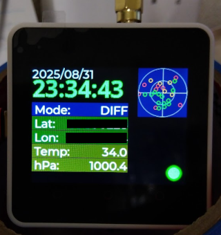
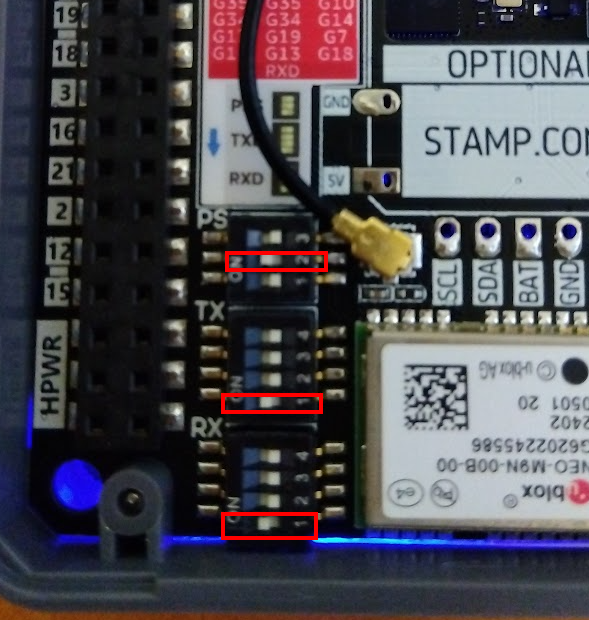

# M5Stack Core2 + GNSSモジュールで作る時計

動作テスト版．

VSCode + PlatformIO用．LVGLは9.2を使用．

Module GNSSはこちら
https://docs.m5stack.com/ja/module/GNSS%20Module

時刻はRTCにも保存しているので，次回起動時にはGNSSを受信できなくても一応時刻は表示される．

GNSSで時刻同期が出来るまでは，時計の文字は赤くなっている．

画面右下の丸いLED風のものは，1PPS入力があると点滅する．ここが点滅していれば正常に測位ができている状態．点滅していない状態では時計は信用できない．

## GNSS基板のディップスイッチの設定

以下の接続になるように設定する．

* PPS: GPIO35
* TX: GPIO14
* RX: GPIO13

赤枠のスイッチがON

## 使用しているフォント

https://fonts.google.com/specimen/Open+Sans

